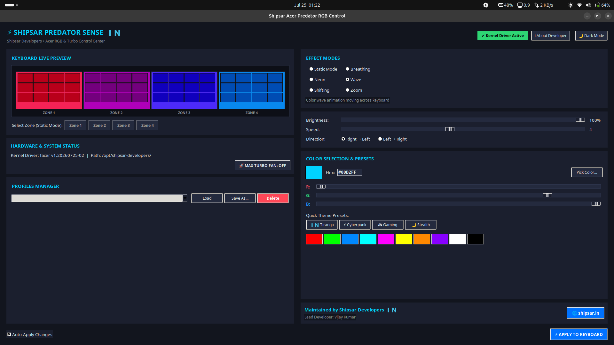

This project is inspired from "https://github.com/JafarAkhondali/acer-predator-turbo-and-rgb-keyboard-linux-module"

# ⚡ Shipsar Acer Predator RGB & Turbo Control

[](https://github.com/shipsar)
[](https://github.com/shipsar)
[](https://www.gnu.org/licenses/old-licenses/gpl-2.0.en.html)
[](https://github.com/shipsar)

A powerful, native Linux kernel driver and graphical control center for **Acer Predator, Helios, and Nitro gaming laptops**. Developed and maintained by **Shipsar Developers**, bringing world-class open-source software engineering from **India 🇮🇳** to the global Linux community.

---



## 🌟 Highlights & Features

- **⚡ Hardware Turbo Mode**: Hardware fan boost button support with auto-persistence across reboots.
- **🎨 4-Zone RGB Backlight Control**: Full control over Static, Breathing, Neon, Wave, Shifting, and Zoom lighting effects.
- **🔄 Auto Kernel Persistence (DKMS)**: Automatically recompiles kernel driver via DKMS on OS kernel upgrades (`apt upgrade` / `pacman -Syu`).
- **🖥️ Native Desktop GUI**: Built with Python Tkinter dark mode interface for all desktop environments (GNOME, KDE Plasma, XFCE, Hyprland).
- **📦 Multi-Distro Packaging**: Pre-built `.deb` packages for Ubuntu/Debian/Mint, AUR packages for Arch/Manjaro, and universal `.run` single-file installers.

---

## 🚀 Installation Options

### Option 1: Debian / Ubuntu / Linux Mint / Pop!\_OS (`.deb` Package) - Recommended

Download the latest `.deb` package from [Releases](https://github.com/shipsar/releases) or build it locally:

```bash
# Build the .deb package
make package-deb

# Install via dpkg / apt
sudo apt install ./dist/shipsar-acer-rgb-controller_1.20260725-1_all.deb
```

_Installed to `/opt/shipsar-developers/acer-rgb-controller/` with automatic DKMS driver updates._

---

### Option 2: Arch Linux / Manjaro / EndeavourOS (AUR / Arch Package)

If you are on Arch Linux, use `makepkg` or build the Arch package source:

```bash
# Build Arch Linux package
make package-arch

# If on Arch Linux host:
sudo pacman -U dist/*.pkg.tar.zst
```

---

### Option 3: Universal Single-File Application (`.run` Bundle)

Works on any Linux distribution without needing package managers:

```bash
# Generate single-file executable
make bundle

# Launch GUI directly
./dist/AcerPredatorRGB.run

# Install system-wide as root
sudo ./dist/AcerPredatorRGB.run --install
```

---

### Option 4: Build All Distribution Packages Simultaneously

```bash
./build_all.sh
# OR
make dist
```

All compiled packages will be placed into the `dist/` directory.

---

## 💻 Graphical User Interface (GUI)

Launch the application anytime from your terminal or the Ubuntu Application Menu:

```bash
rgb-controller
```

_(Aliases `shipsar-acer-rgb` and `facer_gui` are also available for backward compatibility)._

---

## ⚙️ Command Line Interface (CLI)

For scripting, custom hotkeys, or headless server control:

```bash
# Static color (Zone 1 - Cyan)
python3 /opt/shipsar-developers/acer-rgb-controller/facer_rgb.py -m 0 -z 1 -cR 0 -cG 210 -cB 255

# Wave effect (Speed 5, Brightness 100%)
python3 /opt/shipsar-developers/acer-rgb-controller/facer_rgb.py -m 3 -s 5 -b 100
```

---

## 🔧 Systemd Service Management

The installation automatically enables `shipsar-acer-rgb.service` to restore your Turbo mode and lighting settings on boot.

```bash
# Check service status
systemctl status shipsar-acer-rgb

# Start or stop service manually
sudo systemctl start shipsar-acer-rgb
sudo systemctl stop shipsar-acer-rgb
```

---

## 🇮🇳 About Shipsar Developers

**Shipsar Developers** is an innovative software technology firm based in **India 🇮🇳**, dedicated to creating cutting-edge hardware utilities, open-source Linux tools, and high-performance applications for users across the globe.

- **GitHub**: [github.com/shipsar](https://github.com/shipsar)
- **Website**: [shipsar.com](https://shipsar.com)
- **Community & Contributions**: We welcome developers from India and around the world! Check out our [CONTRIBUTING.md](CONTRIBUTING.md) guide.

---

## 📜 License & Acknowledgments

- **Inspiration**: This project is inspired by [Jafar Akhondali's kernel module](https://github.com/JafarAkhondali/acer-predator-turbo-and-rgb-keyboard-linux-module).
- **License**: Released under GNU General Public License v2.0 (GPL-2.0). See [LICENSE](LICENSE) for details.
